HOL-4: Exercise 4: Arc-enable existing Azure Stack HCI Virtual Machines
==============
Overview
-----------
You used have deployed some virtual machines on the Azure Stack HCI Cluster leveraging the Windows Admin Center, it is now time to Arc-enable those assets and look at the Azure Arc-enabled Server capabilities.

Contents
-----------
- [HOL-4: Exercise 4: Arc-enable existing Azure Stack HCI Virtual Machines](#hol-4-exercise-4-arc-enable-existing-azure-stack-hci-virtual-machines)
  - [Overview](#overview)
  - [Contents](#contents)
  - [Task 1: Prepare your Azure environment before onboarding your Azure Arc-enabled Virtual Machine.](#task-1-prepare-your-azure-environment-before-onboarding-your-azure-arc-enabled-virtual-machine)
    - [Create a Resource Group](#create-a-resource-group)
    - [Add a Policy to the newly created Resource Group](#add-a-policy-to-the-newly-created-resource-group)
  - [Task 2: Azure Arc-enable VM002 - Ubuntu Linux 22.04](#task-2-azure-arc-enable-vm002---ubuntu-linux-2204)
    - [Prepare the step in Azure to onboard VM002 as an Azure Arc-enabled Virtual Machine](#prepare-the-step-in-azure-to-onboard-vm002-as-an-azure-arc-enabled-virtual-machine)
    - [Azure Arc-enable virtual machine VM002](#azure-arc-enable-virtual-machine-vm002)
  - [Task 3: Leverage the Azure AD RBAC controls to securely connect to VM002 via the Azure Arc-enabled Server capabilities](#task-3-leverage-the-azure-ad-rbac-controls-to-securely-connect-to-vm002-via-the-azure-arc-enabled-server-capabilities)
  - [Prepare  the Azure Connected Machine agent confiruration on the VM002](#prepare--the-azure-connected-machine-agent-confiruration-on-the-vm002)
  - [Summary](#summary)
  - [Product improvements](#product-improvements)
  - [Raising issues](#raising-issues)

Task 1: Prepare your Azure environment before onboarding your Azure Arc-enabled Virtual Machine.
-----------
In this step, you will create a new Azure Resource Group and assign an extra Azure Policy to this Resource Group

### Create a Resource Group ###

1. In the "Search resources, services, and docs" search box at the top of the Azure Portal page, type **Resource Group** and click **Resource Group** under Services.

    
    
2. On the **Resource Group** page, click **+ Create**.

    

3. On the **Create a resource group** page, type **ArcServers-rg** in the **Resource Group** field. Click **Review + create**. On the next screen click **Create**, to create the new Resource Group.

    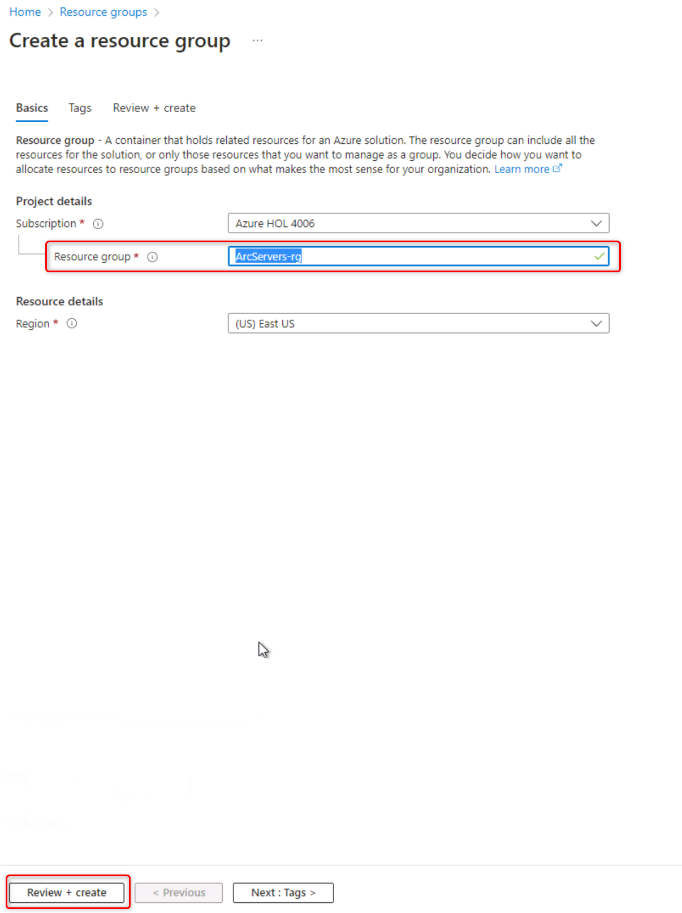

### Add a Policy to the newly created Resource Group ###

1. On the **Resource Group** page, click on the resource group **ArcServers-rg**.

    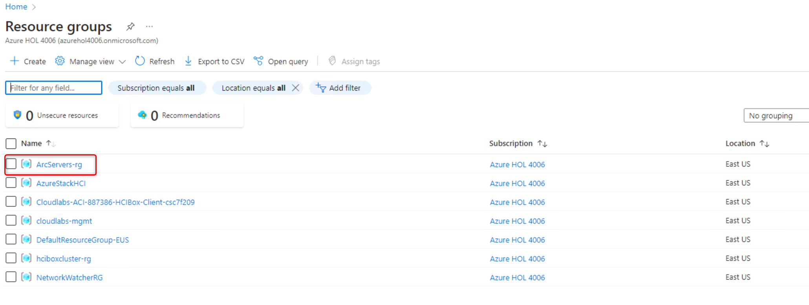
    
2. On the **ArcServers-rg** page, under **Settings**, click **Policies**.

    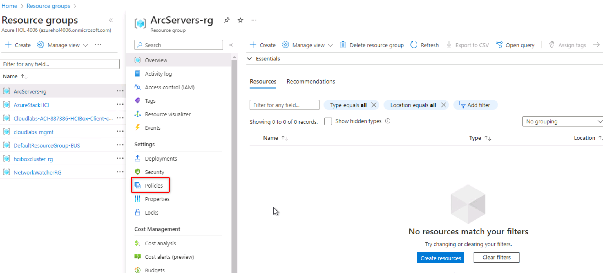

3. On the **Policy | Compliance** page, click **Assign Policy**.

    

4. On the **Assign policy** page, click on the 3 dots on right of the **Policy definition** field. On the **Available Definitions** page, type in search field **Configure periodic checking for missing system updates on azure Arc-enabled servers**. select the policy found below under the Policy Name, **[Preview]: Configure periodic checking for missing system updates on azure Arc-enabled servers**. Click **Add**.

    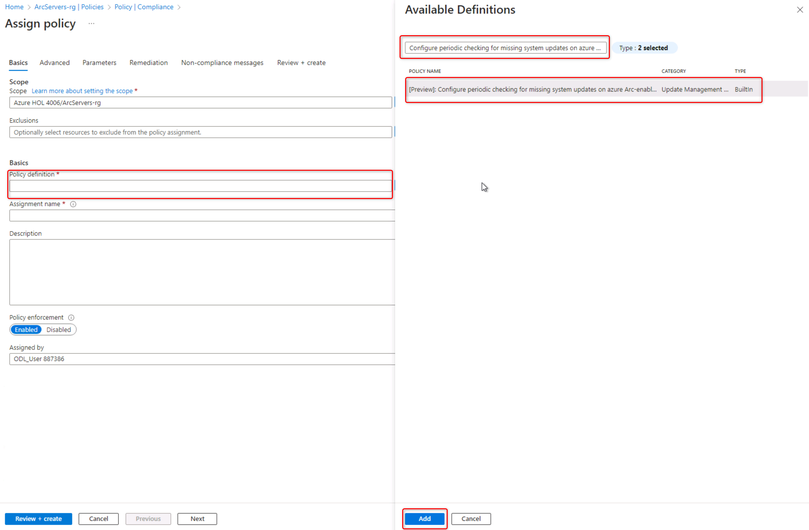

5. On the **Assign policy** page, click **Remediation**. Mark the checkbox before **Create a remediation task**.

    

6. On the **Assign policy** page, click **Review + create**. Click **Create**.

    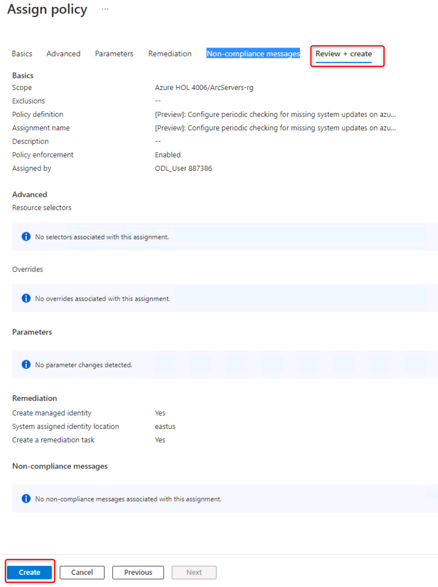

7. After a couple of minutes you should see an extra Policy assigment popping up in the list of Assigned Policies.

    

Task 2: Azure Arc-enable VM002 - Ubuntu Linux 22.04
-----------
In this step, you will download a Windows Server 2022 and Ubuntu Server 22.04 .Iso file and upload the .Iso to your Clustered Shared Volume you explored in Task 1. 

### Prepare the step in Azure to onboard VM002 as an Azure Arc-enabled Virtual Machine ###

1. In the "Search resources, services, and docs" search box at the top of the Azure Portal page, type **Servers** and click **Servers - Azure Arc** under Services.

    
    
2. On the **Azure Arc | Servers** page, Click **+ Add**

    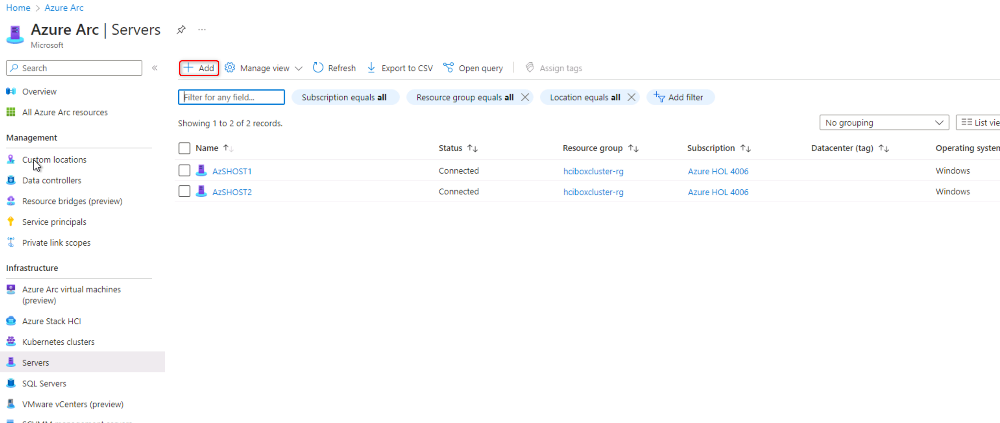

3. On the **Add servers with Azure Arc** page, in the **Add a single server** box, Click **Generate script**

    

4. On the **Add servers with Azure Arc** page, on the *Prerequisites* tab., Click **NEXT**.

    

5. On the **Add servers with Azure Arc** page, on the *Resource details* tab, select the Resource Group **ArcServers-rg**, select **Linux** as Operating System and then Click **NEXT**

    

6. On the **Add servers with Azure Arc** page, on the *Tags* tab, Click **NEXT**
   **NOTE** If you want you can of course add an Cutsom tag, but best practice is that you do this via Azure Policies.

    

7. On the **Add servers with Azure Arc** page, on the *Download and run script* tab, Click **Download** (You later can find it your Downloads folder). Click **Close**.
   
    

### Azure Arc-enable virtual machine VM002 ###
 
1. On **AdminCenter** VM,  type **CMD** in the searchbox (right from Start) and then **ENTER**. Right-click the Command Prompt, and click **Run as Administrator**.
 
    

2. When receiving a **User Account Control** popup screen Click **Yes**
 
    

3. In the **Command Prompt** window, type **"scp C:\Users\arcdemo\Downloads\OnboardingScript.sh"** arcdemo@192.168.200.210:OnboardingScript.sh** and **ENTER**. Type the Password ***ArcPassword123!!*** and **ENTER**. By doing this we will copy the Azure Arc-enabled Server Onboarding Script **OnboardingScript.sh** to VM002.
 
    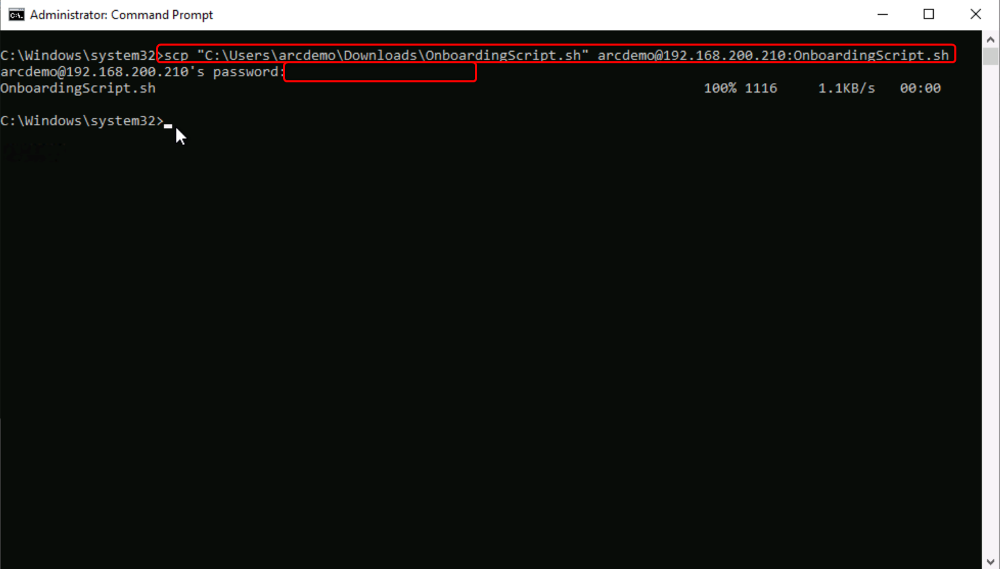

4. In the **Command Prompt** window, type **ssh arcdemo@192.168.200.210** and **ENTER**. Type the Password ***ArcPassword123!!*** and **ENTER**. You now SSHed into the VM002 Virtual Machine.
 
    

5. In the **Command Prompt** window, type **ls** and **ENTER**. You now should see the uploaded Azure Arc-enabled Server Onboarding script **OnboardingScript.sh**. Next start the Onboarding Script by typing **bash ~/OnboardingScript.sh** and **ENTER**. If asked provide the Password **ArcPassword123!!** adn **ENTER**
 
    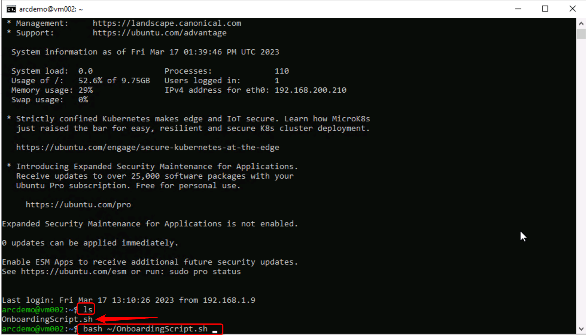

6. When you receive the below screen, double click on the code and then click on your right mouse button to put the code on your Clipboard.
 
    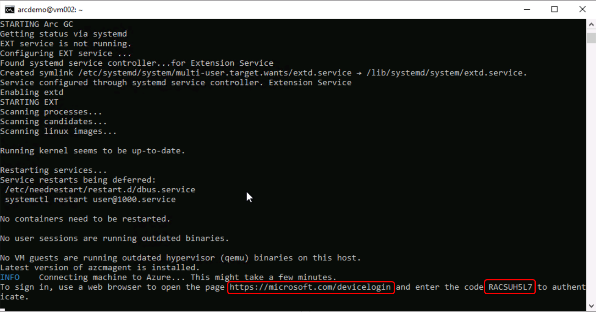

7. Open a new browser tab and go to **https://aka.ms/devicelogin**, paste the Code from your Clipboard (check if there is no extra space behind the code!). Click **NEXT**
 
    

8. Click on the Username. Click **Ask later**. Click **Continue**. Close the Browser tab.
 
    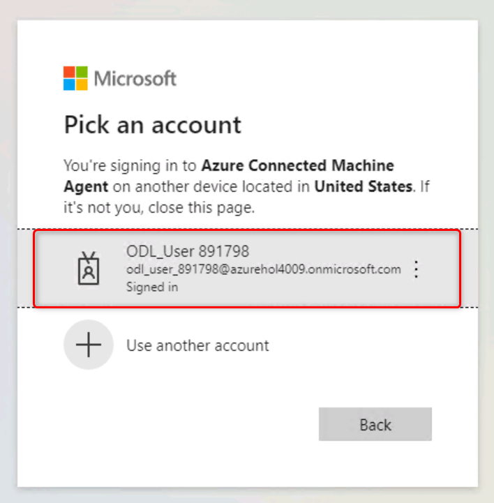
    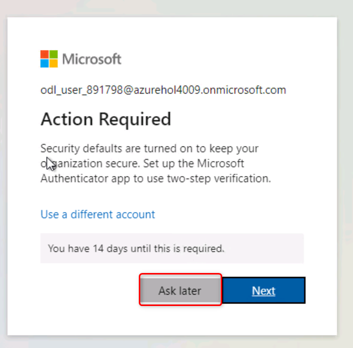
    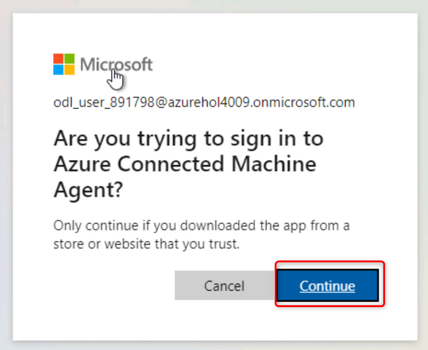

9. Go back to the **Command Prompt** window, where you should see something similar to the below screenshot. Type **exit** and ENTER to disconnect the SSH connection. Type **Exit** again to close the Command Prompt.
 
    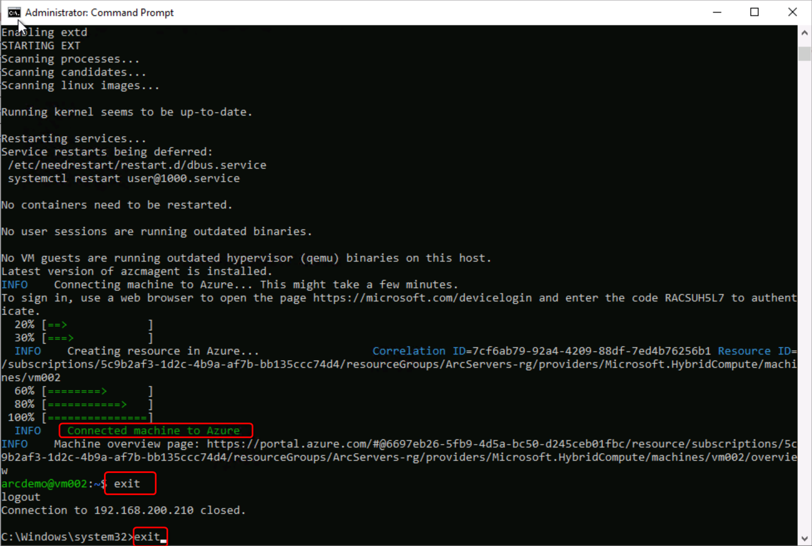

10. In the "Search resources, services, and docs" search box at the top of the Azure Portal page, type **Servers** and click **Servers - Azure Arc** under Services.

    

11. On the **Azure Arc | Servers** page, Click on **vm002**, which you just added as an Azure Arc-enabled virtual machine to Azure.

    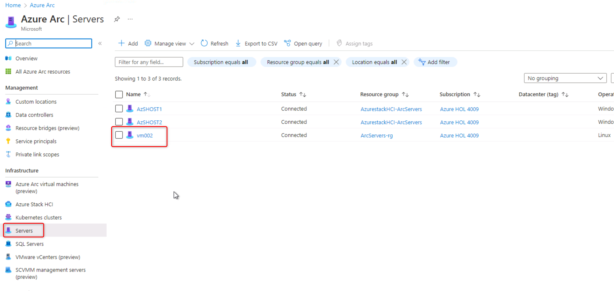

12. On the **vm002** page, click **Policies**.
    
    Do you remember that you assigned an Azure Policy to the Resource Group **ArcServers-rg** in the beginning of this exercise? 
    Now you can check if this Azure policy was successfully assigned to VM002 we added to that ReSource Group.

    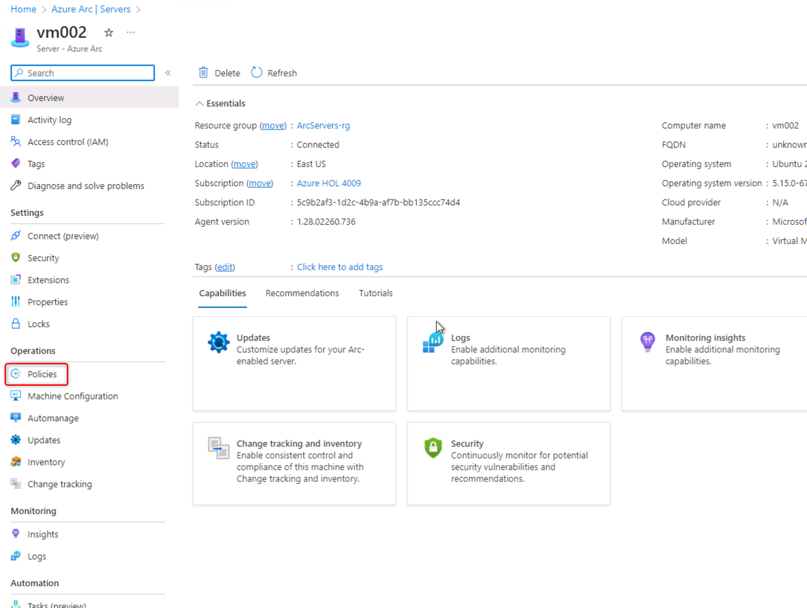

13. Like you will notice the policy was successfully assigned. This is just an example of the power of using Azure Policies. Imagine what you all can automate just by leveraging Azure Policies, not only for Compliance, regulations, Privacy, ... checks
        
    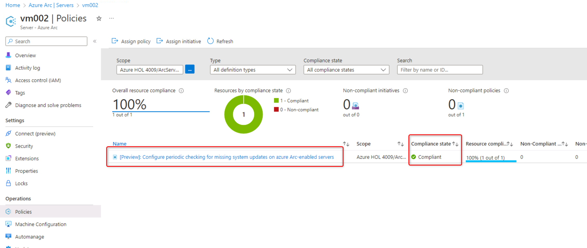

Task 3: Leverage the Azure AD RBAC controls to securely connect to VM002 via the Azure Arc-enabled Server capabilities
----- 
In this step, you will prepare the Azure Connected Machine agent on the VM002 to securely connect to VM002

## Prepare  the Azure Connected Machine agent confiruration on the VM002 ##

1. On **AdminCenter** VM,  type **CMD** in the searchbox (right from Start) and then **ENTER**. Right-click the Command Prompt, and click **Run as Administrator**.
 
    

2. When receiving a **User Account Control** popup screen Click **Yes**
 
    

3. In the **Command Prompt** window, type **ssh arcdemo@192.168.200.210** and **ENTER**. Type the Password ***ArcPassword123!!*** and **ENTER**. You now SSHed into the VM002 Virtual Machine.
 
    

4. In the **Command Prompt** window, type **sudo -i** and **ENTER**. Type the Password ***ArcPassword123!!*** and **ENTER**.
 
    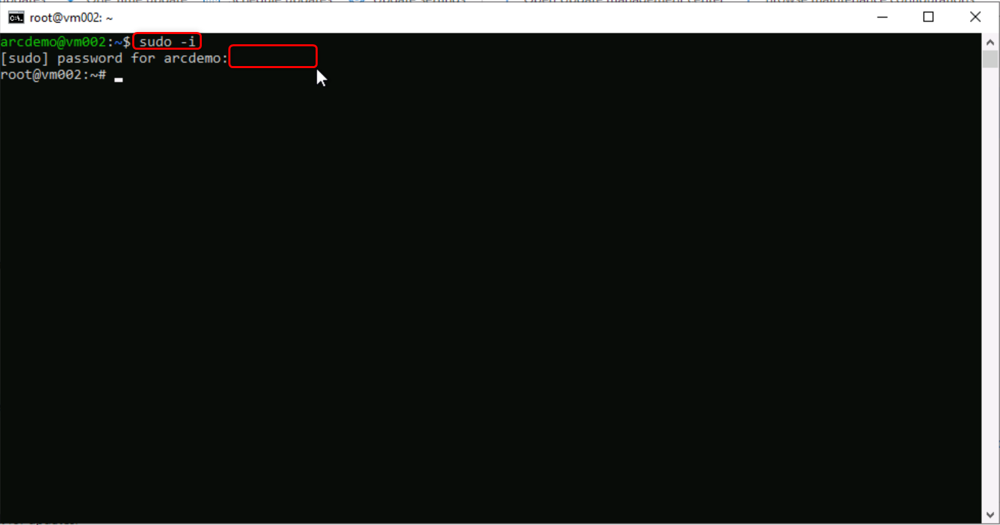

5. In the **Command Prompt** window, type **azcmagent config list** and **ENTER**. You will notice that the configuration of the incomfingconnections.ports value is empty

    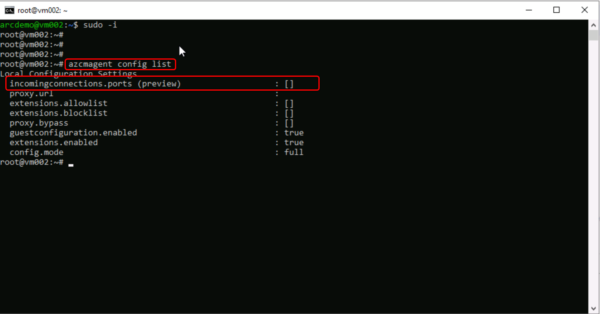

6. In the **Command Prompt** window, type **azcmagent config set incomingconnections.ports 22** and **ENTER**. Now type **azcmagent config list** and **ENTER**. You will notice that the configuration of the incomingconnections.ports value is now set to **22**. Type **Exit** + **Enter** 3 times to close the Command Prompt.

    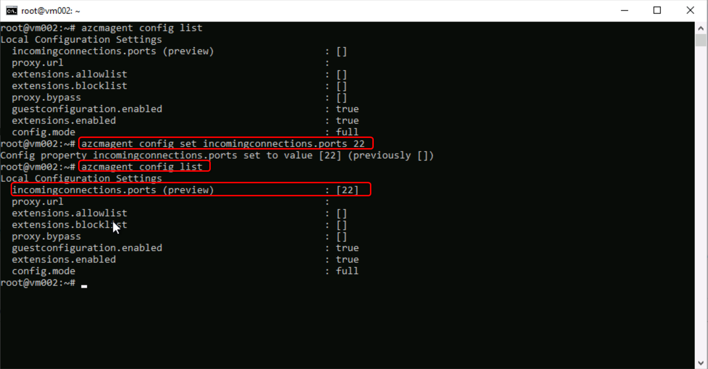

7. Go back to the Azure Portal and in the **"Search resources, services, and docs"** search box at the top of the Azure Portal page, type **vm002** and click **vm002** under **Resources**.

    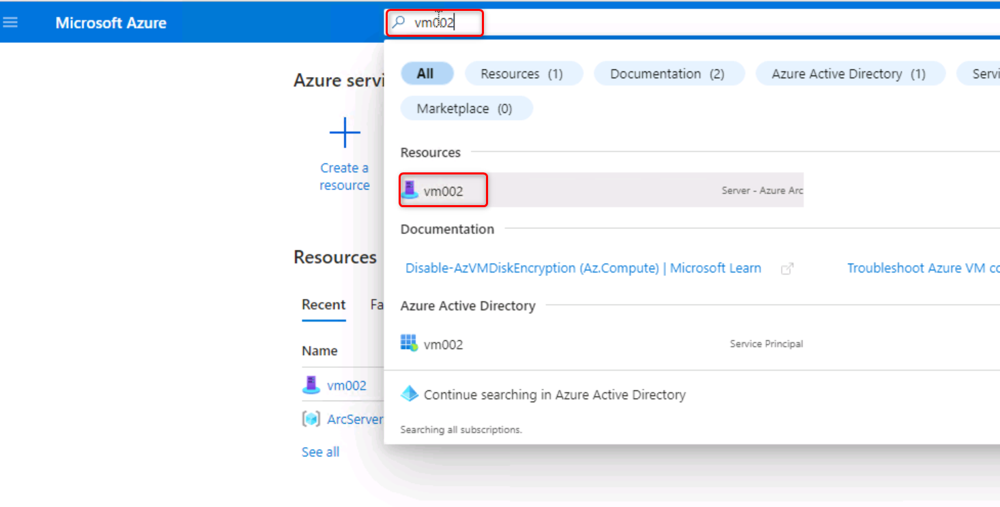

8. On the **vm002** pagem click **Connect** under **settings**. On the **vm002 | Connect** page, click Password. Add **arcdemo** in the Username field. Click **Connect in browser**. If this is the first time you opened an Azure Shell, you will be asked to create a storage account. Click on **Create storage**.

    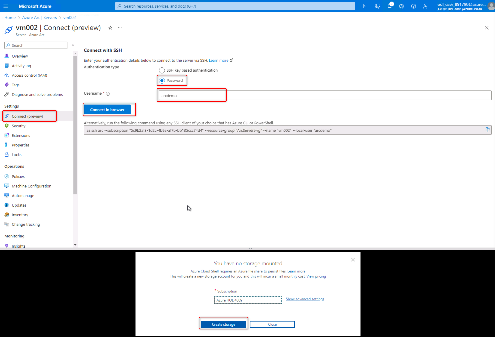

9. If all went well you should have established a SSH connection from within the Azure Portal to your on-premises Azure Arc-enabled Virtual Machine, for example on an Azure Stack HCI.

    **NOTE** Learn more : https://learn.microsoft.com/en-us/azure/azure-arc/servers/ssh-arc-overview    

    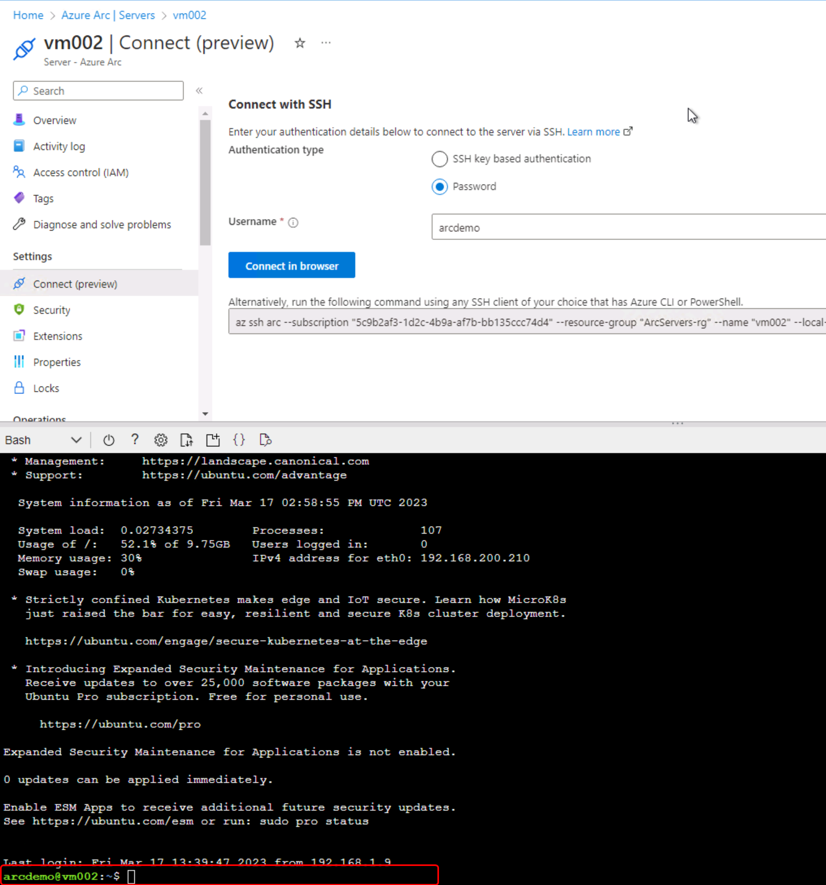

    
Summary
-----------
In this exercise, you have been preparing and onboarding an on-premises Virtual Machine into the Azure control plane, leveraging the Azure Arc-enabled Server solution. We combined this onboarding with a quick look what the power of Azure Policies can bring to you.
You finished this exercise by setting up and testing the new SSH access to Azure Arc-enabled servers.

With this completed, you can now move on to the next exercise.

Product improvements
-----------
If, while you work through this guide, you have an idea to make the product better, whether it's something in Azure Stack HCI, AKS on Azure Stack HCI, Windows Admin Center, or the Azure Arc integration and experience, let us know! We want to hear from you!

For **Azure Stack HCI**, [Head on over to the Azure Stack HCI Q&A forum](https://learn.microsoft.com/en-us/answers/tags/6/azure-stack-hci "Azure Stack HCI Q&A"), where you can share your thoughts and ideas about making the technologies better and raise an issue if you're having trouble with the technology.

For **AKS on Azure Stack HCI**, [Head on over to our AKS on Azure Stack HCI GitHub page](https://github.com/Azure/aks-hci/issues "AKS on Azure Stack HCI GitHub"), where you can share your thoughts and ideas about making the technologies better. If however, you have an issue that you'd like some help with, read on... 

Raising issues
-----------
This lab is based on the Azure Arc Jumpstart HCIBox: https://azurearcjumpstart.io/azure_jumpstart_hcibox/

If you want to setup the lab within your own Azure subscription please follow this link : https://azurearcjumpstart.io/azure_jumpstart_hcibox/#deployment-options-and-automation-flow

If you notice something is wrong with this guide, such as a step isn't working, or something just doesn't make sense - help us to make this guide better!
