HOL-4: Exercise 5: Deploying Virtual Machines on your Azure Stack HCI 22H2 via Azure Portal
==============
Overview
-----------
One of the recent added hybrid features in Azure Stack HCI is the implementation of the Azure Resource Bridge capabilities. You will now use the pre-installed Resource Bridge capabilities to add more VM resource onto the Azure Stack HCI cluster, but using the Azure Portal instead of Windows Admin Center. Remember that you now will use the Azure Portal, but you also can leverage Bicep or ARM templates, or everything which can talk to the APIs.

Contents
-----------
- [HOL-4: Exercise 5: Deploying Virtual Machines on your Azure Stack HCI 22H2 via Azure Portal](#hol-4-exercise-5-deploying-virtual-machines-on-your-azure-stack-hci-22h2-via-azure-portal)
  - [Overview](#overview)
  - [Contents](#contents)
  - [Task 1: Add an Azure Marketplace image to your Azure Stack HCI](#task-1-add-an-azure-marketplace-image-to-your-azure-stack-hci)
  - [Task 2: Deploy an extra Virtual Machine on the Azure Stack HCI cluster from the Azure Portal.](#task-2-deploy-an-extra-virtual-machine-on-the-azure-stack-hci-cluster-from-the-azure-portal)
  - [Summary](#summary)
  - [Congratulations!](#congratulations)
  - [Product improvements](#product-improvements)
  - [Raising issues](#raising-issues)

Task 1: Add an Azure Marketplace image to your Azure Stack HCI
-----------
In this step, you will add an extra virtual machine image to the Azure Stack HCI Cluster.

1. In the **"Search resources, services, and docs"** search box at the top of the Azure Portal page, type **HCIBox-Cluster** and click **HCIBx-Cluster** under **Resources**.

    
        
2. On the **HCIBox-Cluster page**, Click **VM images**.

    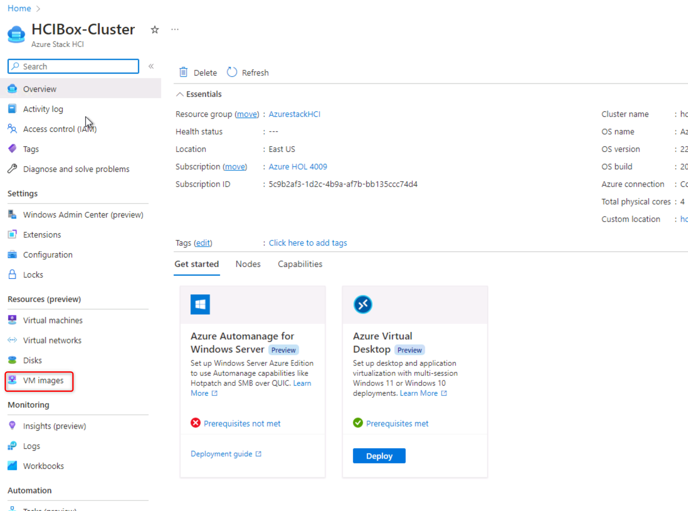
    
3. On the **HCIBox-Cluster | VM images** page, Click **+ VM image** and then Click **From Azure Marketplace**

    

4. On the **Create an image** page, Select the Resource Group **AzureStackHCI** in the Resource Group Field. In the **image to Download** Field select **Windows 11 Enterprise multi-session + Microsoft 365 Apps, version 21H2 - Gen2**. Click **Review + create**. 

    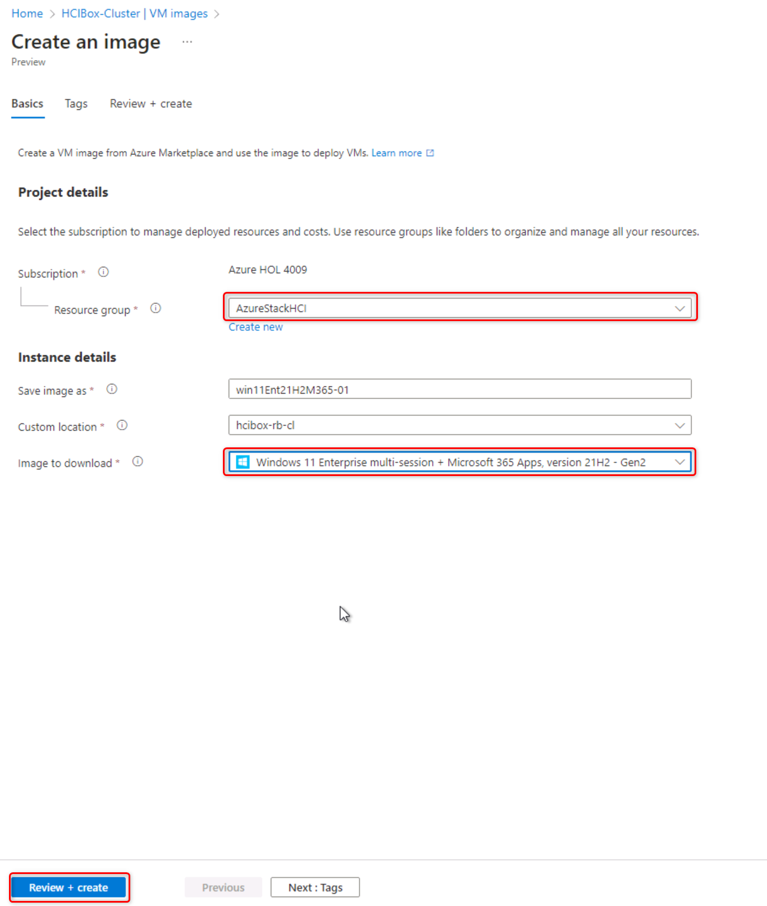

5. On the **Create an image** page, Click **Create**.

    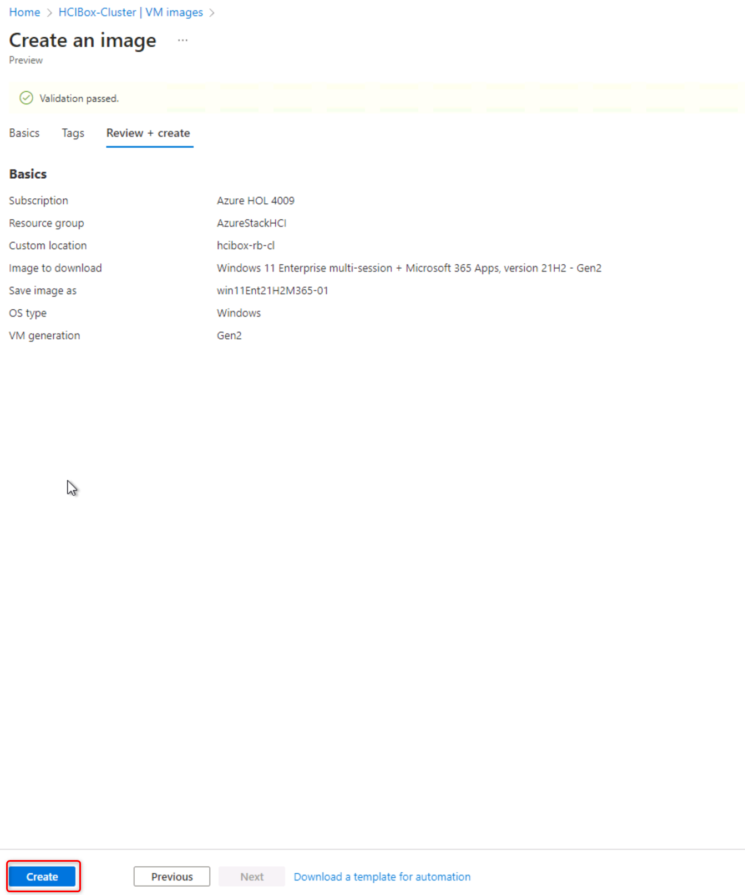

6. You will now be redirected to the **Deployment is in progress** page. This step will take around 60+ minutes. 

    

You now have reviewed and learned more about adding virtual machines images to your Azure Stack HCI, leveraging the Resource Bridge technology.

Task 2: Deploy an extra Virtual Machine on the Azure Stack HCI cluster from the Azure Portal.
-----------
In this step, you will deploy an extra Virtual Machine on the Azure Stack HCI cluster from the Azure Portal.

1. In the **"Search resources, services, and docs"** search box at the top of the Azure Portal page, type **HCIBox-Cluster** and click **HCIBx-Cluster** under **Resources**.

    
        
2. On the **HCIBox-Cluster page**, Click **Virtual machines**.

    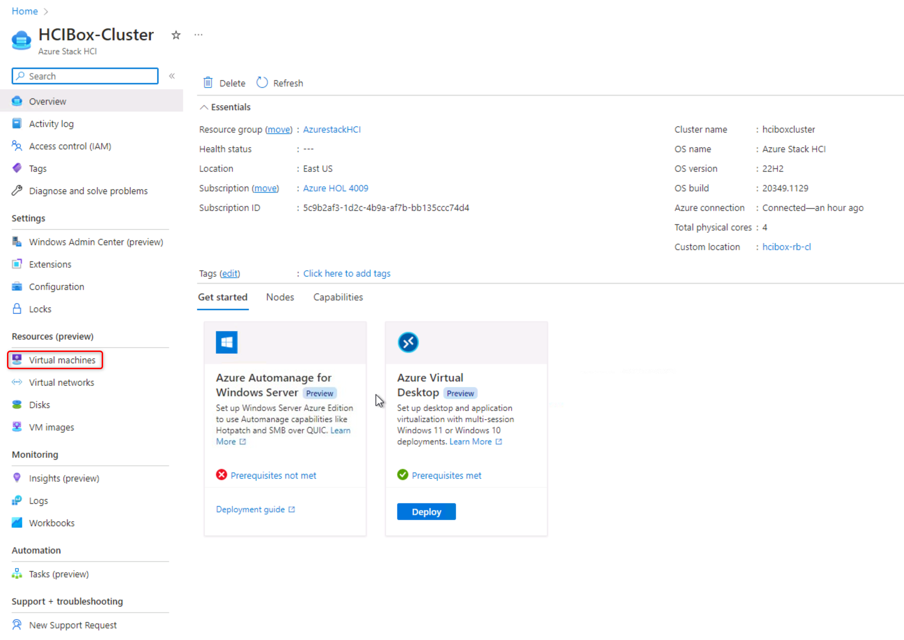
    
3. On the **HCIBox-Cluster | Virtual machines** page, Click **+ Create VM**.

    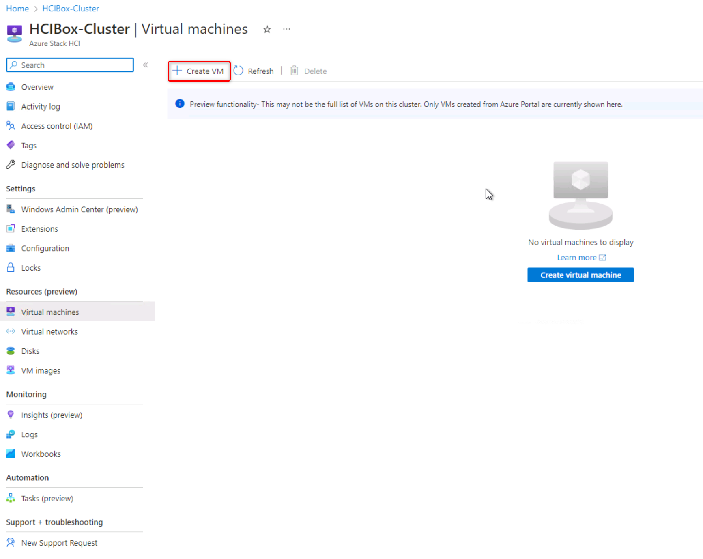

4. On the **Create an Azure Arc virtual machine** page, fill in the below values and then Click **Next : Disk >**

    - Virtual machine name: **VM003**
    - Image: **win2k22**
    - Virtual processor count: **2**
    - Memory (GB): **4**
    - Username: **arcdemo**
    - Password: **ArcPassword123!!**
    - Conform password: **ArcPassword123!!**
    - Enable guest management: *Yes*

    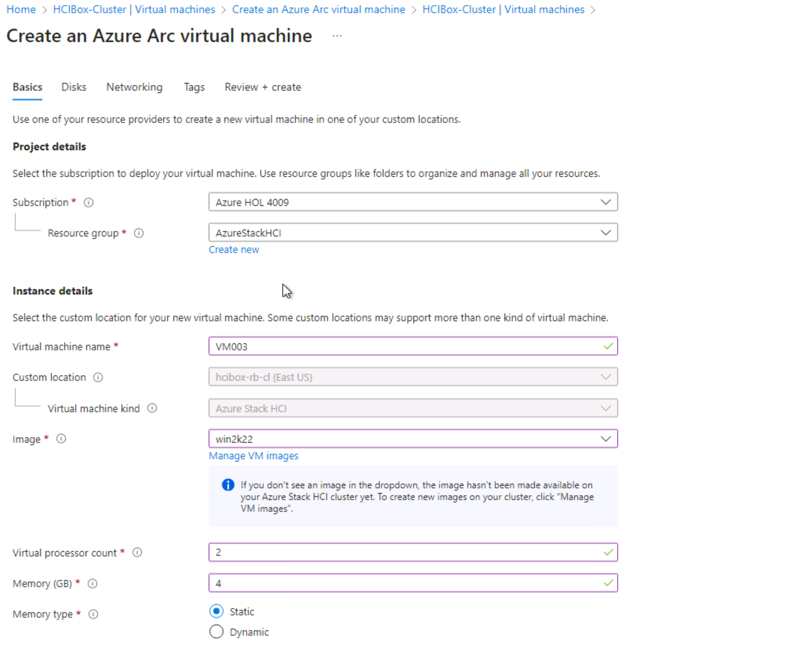
    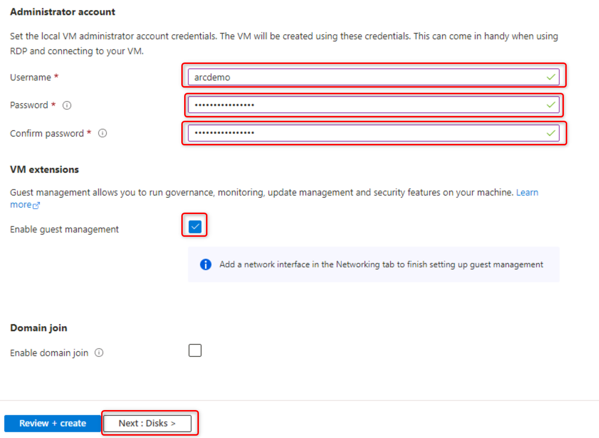

5. On the **Create an Azure Arc virtual machine** page, **Disk** tab, Click **Next : Networking >**

    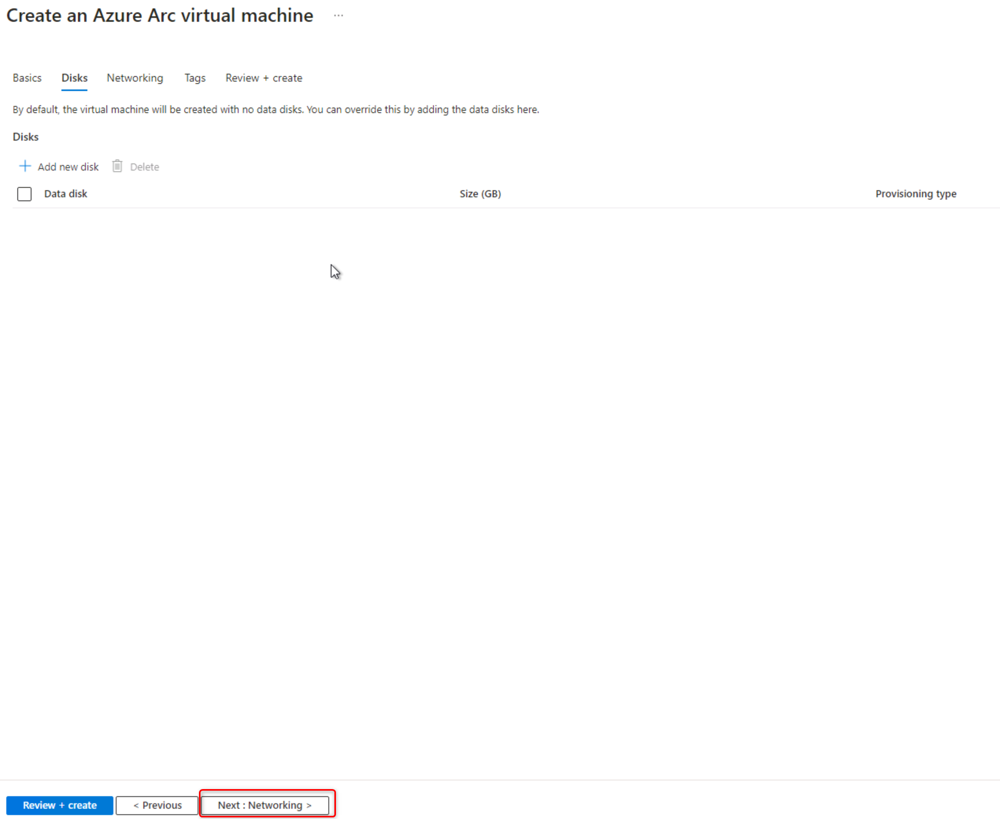

6. On the **Create an Azure Arc virtual machine** page, **Networking** tab, Click **+ Add networking interface**

    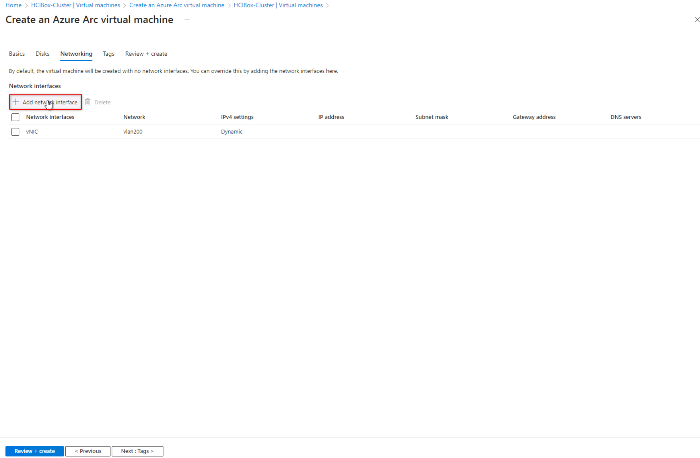   

7. On the **Create an Azure Arc virtual machine** page, fill/select in the below values and then Click **Add**

    - Name: **vNIC**
    - Image: **vlan200**

    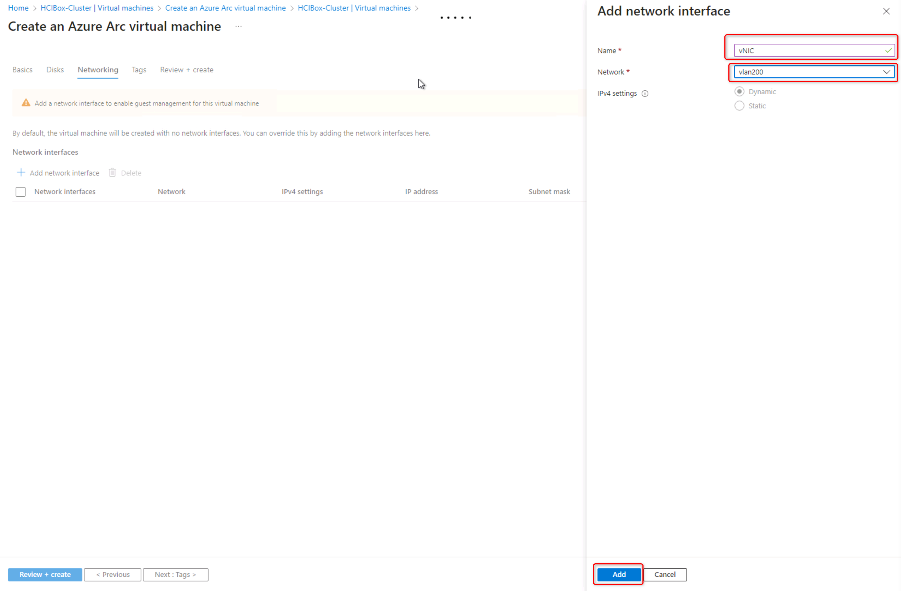

8. On the **Create an Azure Arc virtual machine** page, **Networking** tab, Click **Review + create**

    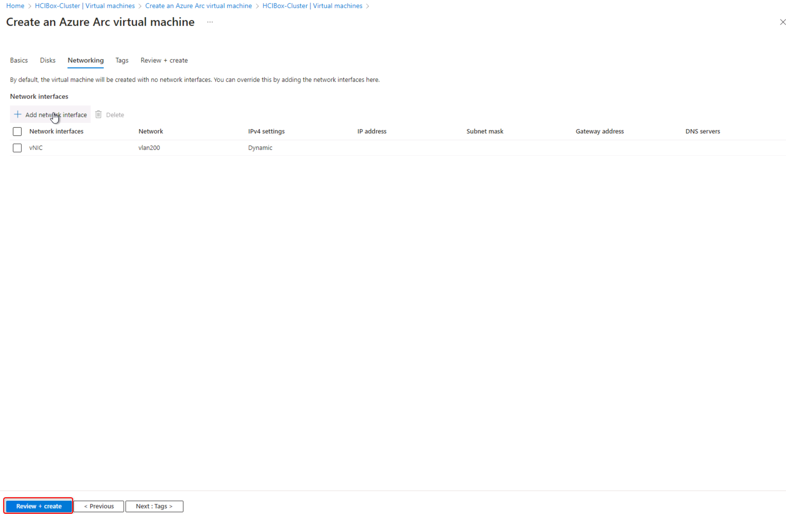

9. On the **Create an Azure Arc virtual machine** page, **Review + create** tab, Click **Create**

    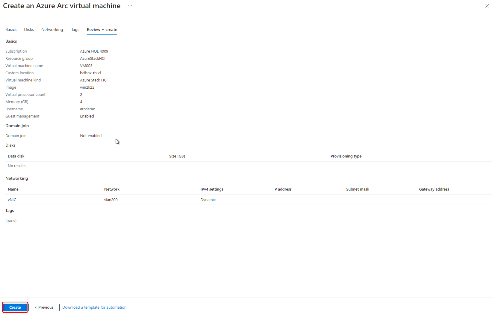

10. On the **Create an Azure Arc virtual machine** page, **Review + create** tab, Click **Create**

    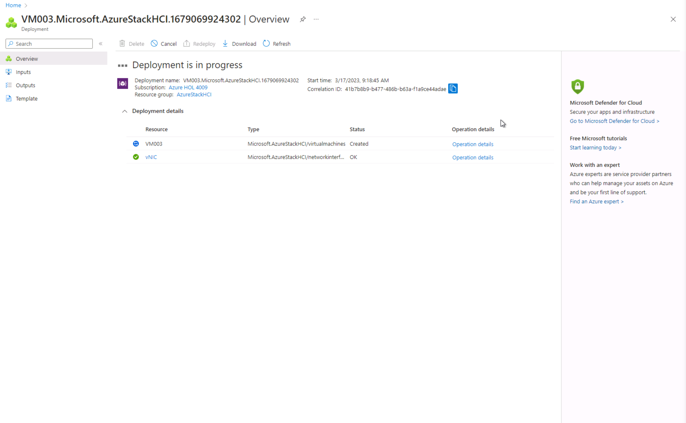

After some time the Deployment will be finished and you will be able to Go to teh create resource. Also check in the Windows Admin Center on the AdminCenter VM under Virtual Machines

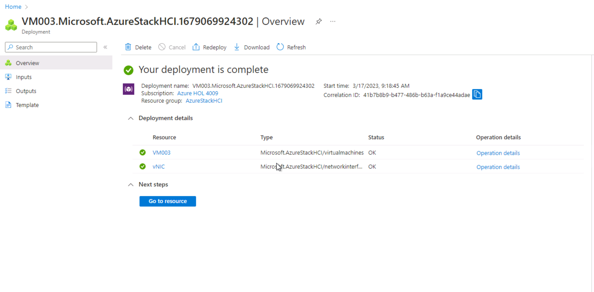   
   

You've successfully deployed an extra Virtual Machine on the Azure Stack HCI cluster from the Azure Portal.

**NOTE** Currently there is an known issue in the Jumpstart HCIBox (Public Preview) solution which impacts the enablement of the guest management.

Summary
-----------
In this exercise, you have added an extra Virtual Machine image to you Azure Stack HCI Cluster from the Azure Marketplace. We finished by adding an extra Virtual Machine on the Azure Stack HCI cluster from the Azure Portal leveraging the Azure Arc Resource Bridge Technology.

Congratulations!
-----------
You've reached the end of this  Azure Stack HCI Hands-on Lab!

Great work!

Product improvements
-----------
If, while you work through this guide, you have an idea to make the product better, whether it's something in Azure Stack HCI, AKS on Azure Stack HCI, Windows Admin Center, or the Azure Arc integration and experience, let us know! We want to hear from you!

For **Azure Stack HCI**, [Head on over to the Azure Stack HCI Q&A forum](https://learn.microsoft.com/en-us/answers/tags/6/azure-stack-hci "Azure Stack HCI Q&A"), where you can share your thoughts and ideas about making the technologies better and raise an issue if you're having trouble with the technology.

For **AKS on Azure Stack HCI**, [Head on over to our AKS on Azure Stack HCI GitHub page](https://github.com/Azure/aks-hci/issues "AKS on Azure Stack HCI GitHub"), where you can share your thoughts and ideas about making the technologies better. If however, you have an issue that you'd like some help with, read on... 

Raising issues
-----------
This lab is based on the Azure Arc Jumpstart HCIBox: https://azurearcjumpstart.io/azure_jumpstart_hcibox/

If you want to setup the lab within your own Azure subscription please follow this link : https://azurearcjumpstart.io/azure_jumpstart_hcibox/#deployment-options-and-automation-flow

If you notice something is wrong with this guide, such as a step isn't working, or something just doesn't make sense - help us to make this guide better!
