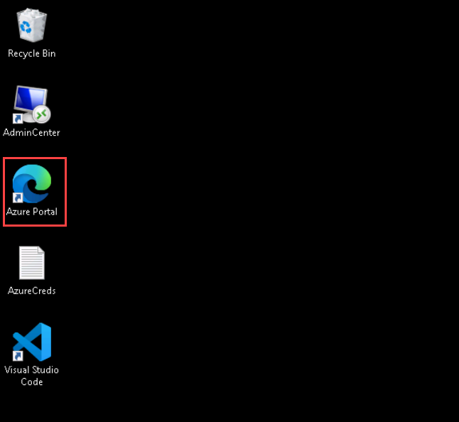
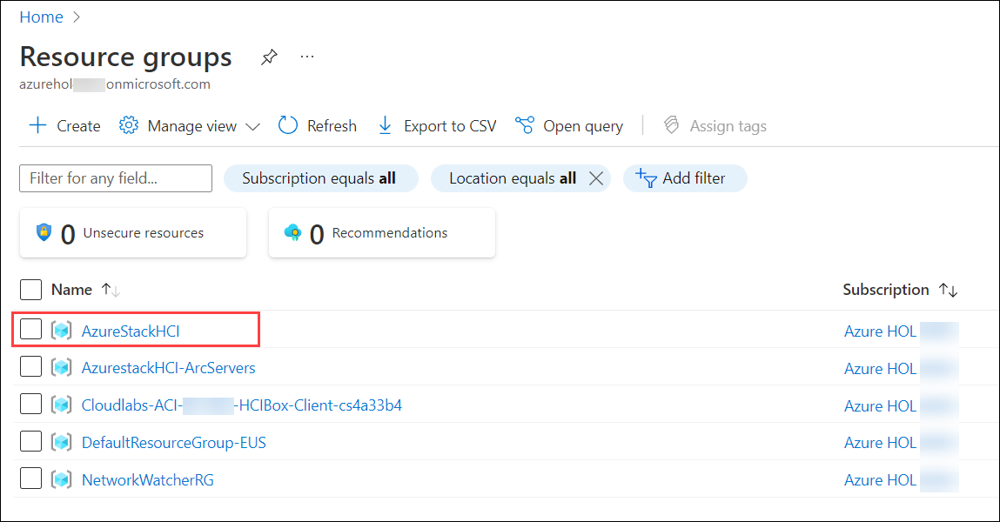
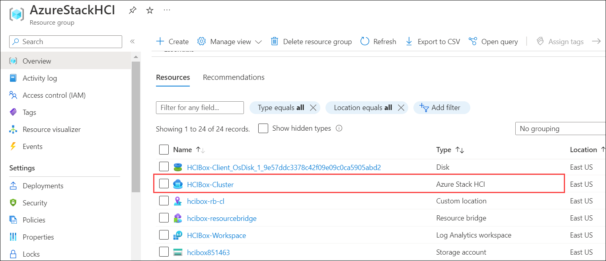
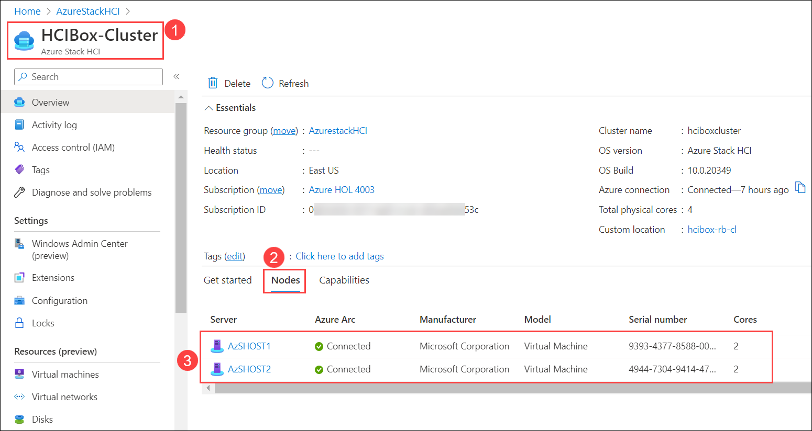
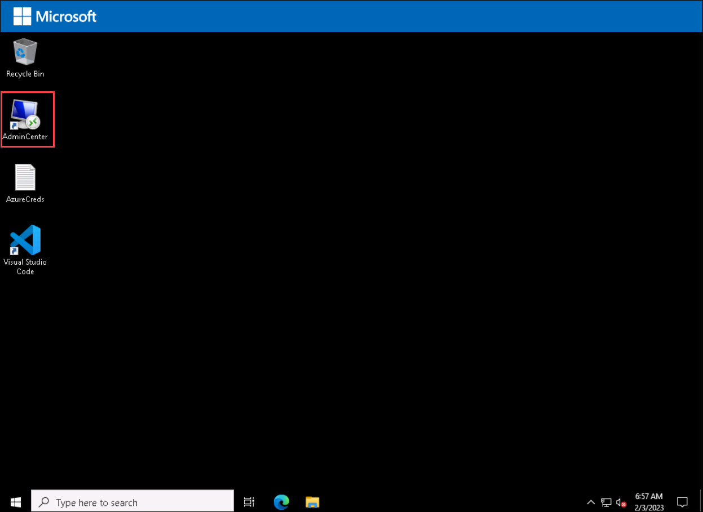
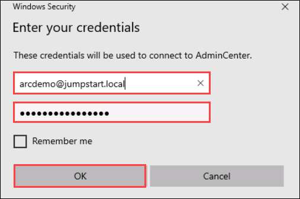
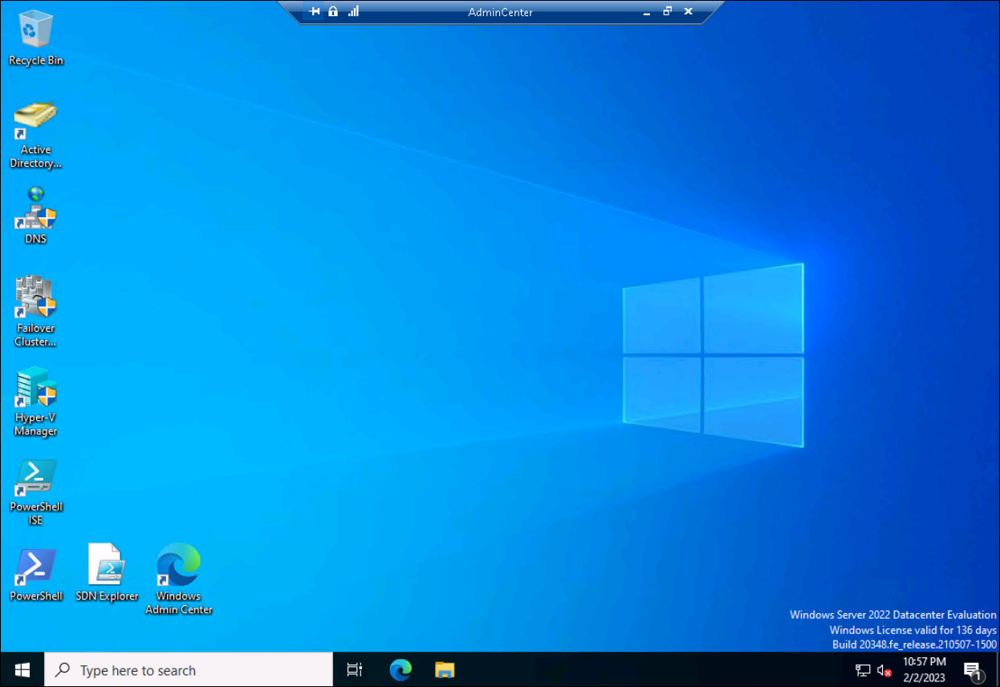

Getting Started With Azure Stack HCI with Azure
-------------------------

# Getting Started with the Lab

1. Once the environment is provisioned, a virtual machine i.e, **HCIBox-Client** will be provisioned. Connect to the **HCIBox-client**  virtual machine via Azure Bastion. 

## Login to Azure Portal

1. In the **HCIBox-Client** virtual machine, double click on the Azure portal shortcut of Microsoft Edge browser which is provided on the desktop.
  
    
    
1. On the **Sign into Microsoft Azure** tab, you will see the login prompt. Enter the following **Email/Username** and then click on **Next**. 
      
      * Email/Username: <inject key="AzureAdUserEmail"></inject>
   
1. Now, enter the **Password** which you have already received for the above account.
      
      * Password: <inject key="AzureAdUserPassword"></inject>
      
1. If you see the pop-up **Stay Signed in?**, click No

1. If you see the pop-up **You have free Azure Advisor recommendations!**, close the window to continue the lab.

1. If **Welcome to Microsoft Azure** popup window appears, click **Maybe Later** to skip the tour.

1. Navigate to the Resource Group in the Azure portal navigate section.

   

1. From the Resource groups pane, click on **AzureStakHCI** resource group and verify the resources present in it.

   

1. You can see the onboarded cluster in the **AzureStackHCI** resource group, select the **HCIBox-Cluster** Azure Stack HCI resource.

   
   
1. Once you are in **Overview** page of Azure Stack HCI resource named **HCIBox-Cluster** **(1)**. Click on **Nodes** **(2)** and verify the **AzSHOST1** and **AzSHOST2** servers are connected to Azure Arc **(3)** as shown in the below screenshot.

   

## Connect to Admin Center

1. Navigate to **HCIBox-Client** virtual machince desktop and double-click on the **Admin Center** shortcut which is created on the desktop.

   
   
1. Enter the below credentials to login to **Admin Center** and click on **OK**.

   * Username: **arcdemo@jumpstart.local**
   * Password: **ArcPassword123!!**  

   
   
1. Once you are connected to Admin Center, you can see the screen as shown below in the screenshot:

   

Summary
-----------
In this exercise, you've successfully login into the Azure Portal and tested if you could Connected to the AdminCenter Virtual Machine in the HCIBoxClient Azure VM.

With this completed, you can now move on to the next exercise. Click [Here](1_AzSHCIIntegration.md) to start the first exercise.

Product improvements
-----------
If, while you work through this guide, you have an idea to make the product better, whether it's something in Azure Stack HCI, AKS on Azure Stack HCI, Windows Admin Center, or the Azure Arc integration and experience, let us know! We want to hear from you!

For **Azure Stack HCI**, [Head on over to the Azure Stack HCI Q&A forum](https://learn.microsoft.com/en-us/answers/tags/6/azure-stack-hci "Azure Stack HCI Q&A"), where you can share your thoughts and ideas about making the technologies better and raise an issue if you're having trouble with the technology.

For **AKS on Azure Stack HCI**, [Head on over to our AKS on Azure Stack HCI GitHub page](https://github.com/Azure/aks-hci/issues "AKS on Azure Stack HCI GitHub"), where you can share your thoughts and ideas about making the technologies better. If however, you have an issue that you'd like some help with, read on... 

Raising issues
-----------
This lab is based on the Azure Arc Jumpstart HCIBox: https://azurearcjumpstart.io/azure_jumpstart_hcibox/

If you want to setup the lab within your own Azure subscription please follow this link : https://azurearcjumpstart.io/azure_jumpstart_hcibox/#deployment-options-and-automation-flow

If you notice something is wrong with this guide, such as a step isn't working, or something just doesn't make sense - help us to make this guide better!